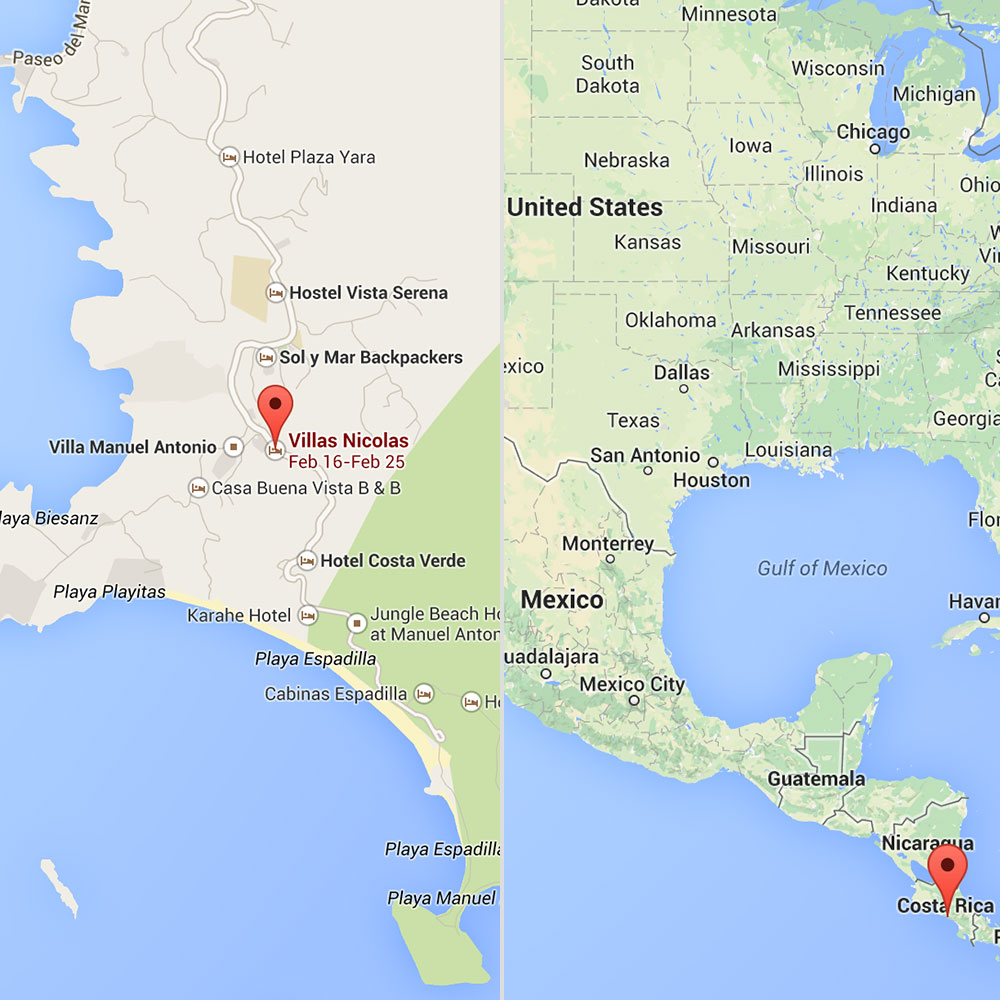

# ClojureRica

:earth_americas: [`codecation.github.io/2014-02-clojure-rica`](http://codecation.github.io/2014-02-clojure-rica)

[@r00k](http://twitter.com/r00k) and [@chrishunt](http://twitter.com/chrishunt)
learn [ClojureScript](https://github.com/clojure/clojurescript) in [Costa
Rica](http://goo.gl/d6UZRP)

